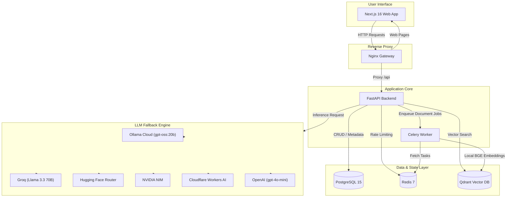

# Enterprise RAG Platform

A production-ready, multi-tenant **Retrieval-Augmented Generation (RAG)** platform designed for enterprise document ingestion, vector search, and AI-powered intelligence.

Built with **FastAPI**, **Next.js 16**, **Qdrant**, **PostgreSQL**, **Redis**, and **Celery**, featuring a resilient multi-provider LLM fallback chain, offline local vector embeddings, ground-truth source citations, and rich Markdown/table rendering.

---

## 🌟 Key Highlights & Features

- **Document Ingestion Pipeline**: Asynchronous parsing, chunking, and real-time multi-stage progress tracking (Upload ➔ Extract & Chunk ➔ Vector Index ➔ Ready) for PDF, DOCX, TXT, and Markdown documents.
- **Multi-Provider LLM Fallback Engine**: Resilient multi-tier fallback architecture ensuring zero-downtime chat:
  1. **Ollama Cloud** (`gpt-oss:20b`)
  2. **Groq** (`llama-3.3-70b-versatile`, `llama-3.1-8b-instant`)
  3. **Hugging Face Inference Router** (`Qwen2.5-72B-Instruct`, `Llama-3.2-3B`)
  4. **NVIDIA NIM** (`meta/llama-3.1-70b-instruct`)
  5. **Cloudflare Workers AI** (`@cf/meta/llama-3.1-8b-instruct`)
  6. **OpenAI** (`gpt-4o-mini`)
  7. **Deterministic Extractive Fallback**
- **Offline High-Speed Vector Embeddings**: Local snapshot of `BAAI/bge-small-en-v1.5` (384-dim) loaded offline inside the container (~300ms vector search, eliminating network latency or HF Hub stalls).
- **Exact Source Attribution & Deduplication**:
  - RAG prompt extracts exact source references from the LLM (e.g. `[SOURCES_USED: 2]`).
  - Citations display human-readable PDF filenames (e.g. `Resume_v0.4.pdf • Page 2 • 59.2% match`) rather than raw UUIDs.
  - Page-level deduplication eliminates repetitive citations from the same page.
- **Rich Markdown & Table Rendering**:
  - Assistant answers are rendered with `react-markdown` and `remark-gfm`.
  - Full support for responsive HTML `<table>`, code blocks, lists, and formatted typography.
- **Multi-Tenant Isolation**: Strict tenant isolation in PostgreSQL and Qdrant using scoped payload filtering (`user_id`).
- **Distributed Asynchronous Workers**: Celery workers backed by Redis for document chunking and vector upserting.
- **Production-Ready Security**: Secure HttpOnly cookie-based JWT authentication, CORS, rate limiting, and Nginx reverse proxy.

---

## 🛠 System Architecture



---

## 💻 Tech Stack

| Layer | Technologies |
|---|---|
| **Backend** | Python 3.11, FastAPI, SQLAlchemy 2.0 (Async), Alembic, Pydantic v2 |
| **Task Queue** | Celery, Redis |
| **Vector DB** | Qdrant (HNSW Cosine Vector Indexing) |
| **Database** | PostgreSQL 15 |
| **Embeddings** | `BAAI/bge-small-en-v1.5` (Local HuggingFace / SentenceTransformers) |
| **LLMs** | Ollama Cloud, Groq, Hugging Face, NVIDIA NIM, Cloudflare AI, OpenAI |
| **Frontend** | Next.js 16 (App Router, Turbopack), React 19, Tailwind CSS, shadcn/ui |
| **Proxy & Infra** | Docker, Docker Compose, Nginx Alpine |

---

## 🚀 Quick Start with Docker

### 1. Clone & Configure Environment

```bash
git clone https://github.com/r4m335/Enterprise-RAG-Platform.git
cd Enterprise-RAG-Platform

# Copy example environment configuration
cp .env.example .env
```

Edit `.env` to supply any API keys you wish to use (Ollama Cloud, Groq, Hugging Face, NVIDIA, or OpenAI). The system gracefully falls back across available providers.

### 2. Launch Stack

```bash
docker compose up --build -d
```

This starts all 7 containers:
- `erag_nginx`: Port `80` (Unified entrypoint)
- `erag_frontend`: Port `3000` (Next.js web UI)
- `erag_backend`: Port `8000` (FastAPI backend)
- `erag_celery_worker`: Background document processing & embedding
- `erag_postgres`: Port `5434`
- `erag_redis`: Port `6379`
- `erag_qdrant`: Port `6333`

### 3. Access the Application

- **Web Dashboard & Chat**: [http://localhost:3000](http://localhost:3000) (or [http://localhost](http://localhost))
- **Interactive API Documentation (Swagger)**: [http://localhost:8000/api/v1/docs](http://localhost:8000/api/v1/docs)

---

## 🧪 Testing

### Backend Unit & Integration Tests (Pytest)
```bash
docker compose exec backend sh -c "PYTHONPATH=/app /opt/venv/bin/pytest"
```

### Frontend End-to-End Tests (Playwright)
```bash
cd frontend
npm ci
npx playwright test
```

---

## 🔒 Security & Privacy

- **Tenant Isolation**: All vector points and database records are strictly isolated by `user_id`. Queries cannot access documents belonging to other users.
- **Zero Key Leakage**: Keys are stored exclusively on the server in `.env` (ignored by Git).
- **Offline Embeddings**: Sensitive document text is embedded locally inside the container via `bge-small-en-v1.5` without being transmitted to third-party embedding APIs.

---

## 📄 License

This project is licensed under the MIT License.
